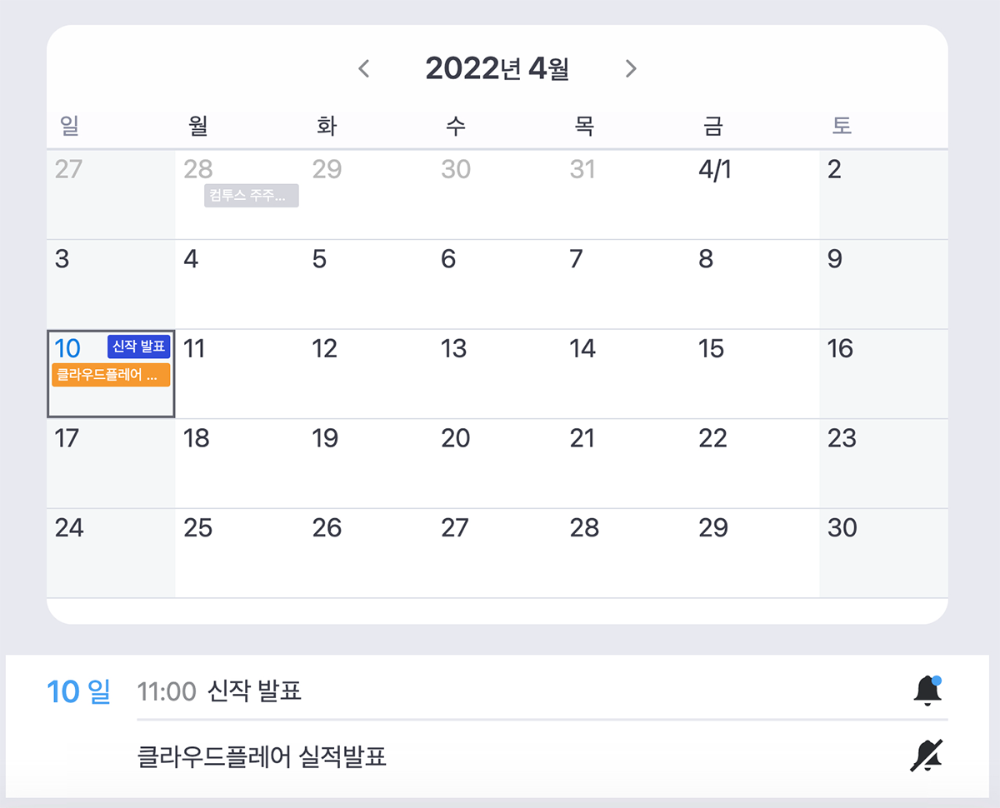

# README.md

Assign: trading-log README

# Description

---

주식 매매일지를 기록할 수 있는 앱입니다.

- 개발기간: 2021/11 ~ 2022/02
- 사용기술: `Next.js` `Firebase/firestore` `Express.js` `next-auth` `Emotion.js` `Typescript` `Redux`

# Usage

---

1. `yarn` | `npm i`
2. `yarn dev` | `npm run dev`

# Details

---

- 파이어베이스 Firestore 사용
- 주식 매매일지/일정관리 CRUD 구현
- 라이브러리 사용하지 않고 달력 구현 — useCalendar 커스텀 훅스
- 구글 캘린더와 유사한 스케줄 UI 구현
- Figma로 직접 디자인
- next-auth 사용한 Goole Oauth 로그인 구현
- 토스트 알람 직접 구현

# Architecture

---


| components | 컴포넌트 |
| --- | --- |
| core | 코어 기능 모음
— auth, firestore method |
| hooks | 커스텀 훅스 |
| lib | 공통함수 |
| pages | next.js routers |
| public | static files |
| store | redux store |
| styles | 글로벌 스타일, 공통 스타일 컴포넌트(keyframes, animation) |
| svgs | svg 컴포넌트 |

# Trouble Shooting

---

### 파이어스토어에 저장된 Timestamp을 컴포넌트에서 사용하는 Date 객체로 파싱 — timestamp.ts

- core/firestore/timestamp.ts 에 관련 함수를 모아놓고 모듈화
    - 타임스탬프 객체를 Date 객체로 변환하는 함수
    
    ```tsx
    const getDateObjFromTimestamp = (date: Timestamp): IFullDateObj => {
      const _t = date.toDate();
      const _y = _t.getFullYear();
      const _m = _t.getMonth();
      const _d = _t.getDate();
      const _day = _t.getDay();
      const _h = _t.getHours();
      const _minutes = _t.getMinutes();
    
      return { _t, _y, _m, _d, _day, _h, _minutes };
    };
    ```
    
    - Date 객체를 Epoch 시간으로부터의 시간<number>으로 변환하는 함수
    
    ```tsx
    const secondsSinceEpoch = (d: any) => Math.floor(d / 1000);
    ```
    

### 이번달 데이터 보여주기 — useCalender.tsx

- useCalender hooks로 현재 날짜를 구한 후 첫째 날과 마지막 날 계산
- 첫째 날부터 마지막 날 까지의 시간을 1일 단위로 나눈 Epoch 시간 배열 만들기<number[]>

```tsx
useEffect(() => {
    const _currYM = getYM(currYear, currMonth);
    setCurrYM(_currYM);
    const {
      init_d: first_d,
      init_d_date: first_d_date,
      init_d_day: first_d_day,
      init_d_sec: first_d_sec,
    } = getInitDateObj(currYear, currMonth, 1);

    const {
      init_d: last_d,
      init_d_date: last_d_date,
      init_d_day: last_d_day,
      init_d_sec: last_d_sec,
    } = getInitDateObj(currYear, currMonth + 1, 0);

    setFirstDateSec(first_d_sec);
    setLastDateSec(last_d_sec);

    let start_date = first_d_sec;
    let end_date = last_d_sec;

    // 일요일로 시작하거나 토요일로 끝나지 않는 경우
    if (first_d_day !== 0) start_date = first_d.setDate(first_d_date - first_d_day) / 1000; // seconds을 구하기 위해 1000으로 나눔
    if (last_d_day !== 6) end_date = last_d.setDate(last_d_date + (6 - last_d_day)) / 1000;

    // startDate, endDate가 주어진 경우
    if (start_date_sec) start_date = start_date_sec;
    if (end_date_sec) end_date = end_date_sec;

    // 1일 단위로 배열로 만들기
    const seconds = getDateRangeByDay(start_date, end_date);
    setStartDateSec(start_date);
    setEndDateSec(end_date);
    setSecondsFromEpoch(seconds);
  }, [currMonth, currYear, start_date_sec, end_date_sec]);
```

- 한달 달력은 CalenderForm 컴포넌트에서 렌더링, FormDateArea 컴포넌트에서 각 날짜 칸 렌더링

### 토스트 알람 라이브러리 없이 직접 구현 — ToastController.tsx, Toast.tsx

- ToastController.tsx

```tsx
import ReactDOM from "react-dom";
import Toast, { ToastType, ToastProps } from "./Toast";

interface ToastOptions {
  id?: string;
  message: string;
  type: ToastType;
  duration?: number;
}

export class ToastController {
  private containerRef: HTMLDivElement | undefined;
  private toasts: ToastProps[] = [];

  public insertBodyContainer() {
    const toastContainer = document.getElementById("toast-container") as HTMLDivElement;
    toastContainer.setAttribute("style", "position: fixed; right: 0; top: 0;");
    const toastBackground = document.createElement("div");
    toastBackground.setAttribute("style", "position: relative; right: 3rem; top: 11rem;");
    toastContainer.insertAdjacentElement("beforeend", toastBackground);
    this.containerRef = toastBackground;
  }

  public show(options: ToastOptions) {
    const toastId = Math.random().toString(36).substr(2, 9);
    const toast: ToastProps = {
      id: toastId, // 무한 생성시 toastId 넣기
      ...options,
      destroy: () => this.destroy(options.id ?? toastId),
    };
    this.toasts = [...this.toasts, toast];
    this.render();
  }

  public destroy(id: string): void {
    this.toasts = this.toasts.filter((toast: ToastProps) => toast.id !== id);
    this.render();
  }

  public render(): void {
    const toastsList = this.toasts.map((toastProps: ToastProps) => <Toast key={toastProps.id} {...toastProps} />);
    if (this.containerRef) ReactDOM.render(toastsList, this.containerRef as HTMLDivElement);
  }
}

export const toast = new ToastController();
```

- Toast.tsx

```tsx
import { useEffect } from "react";
import styled from "@emotion/styled";
import useFade from "hooks/useFade";
import useSlide from "hooks/useSlide";

export const ToastTypes = {
  fail: "fail",
  success: "success",
  warning: "warning",
} as const;

export type ToastType = typeof ToastTypes[keyof typeof ToastTypes];

export interface ToastProps {
  id: string;
  message: string;
  destroy: () => void;
  type: ToastType;
  duration?: number;
}

const typesOption = {
  fail: { color: "#EE5555", src: "/images/ico__toast_fail.svg" },
  success: { color: "#4BA9FE", src: "/images/ico__toast_success.svg" },
  warning: { color: "#F59A2F", src: "/images/ico__toast_warning.svg" },
};

const Toast = ({ id, message, destroy, type, duration = 3000 }: ToastProps) => {
  const { isVisible, setShow: setShowToast, slideProps } = useSlide(true);

  // slideOut 효과 (duration 동안)
  useEffect(() => {
    if (!duration || !isVisible) return;

    const timer = setTimeout(() => {
      setShowToast(false);
    }, duration);

    return () => clearTimeout(timer);
  }, [setShowToast, duration, isVisible]);

  // slideOut 효과 이후 destroy
  useEffect(() => {
    if (isVisible) return;
    const timer = setTimeout(() => {
      destroy();
    }, 100);

    return () => clearTimeout(timer);
  }, [destroy, isVisible]);

  const handleClose = () => {
    setShowToast(false);
  };

  const { isVisible: isCloseBtnVisible, setShow: setShowCloseBtn, fadeProps } = useFade(false);

  const handleMouseEnter = () => {
    setShowCloseBtn(true);
  };

  const handleMouseLeave = () => {
    setShowCloseBtn(false);
  };

  return (
    <>
      {isVisible && (
        <ToastLayer data-id={id} {...slideProps}>
          <ToastCont barColor={typesOption[type].color} onMouseEnter={handleMouseEnter} onMouseLeave={handleMouseLeave}>
            <TypeIcon iconSrc={typesOption[type].src} />
            {message}
            {isCloseBtnVisible && <CloseBtn type="button" onClick={handleClose} {...fadeProps} />}
          </ToastCont>
        </ToastLayer>
      )}
    </>
  );
};

const CloseBtn = styled.button`
  position: absolute;
  top: 4px;
  right: 4px;
  display: block;
  width: 2rem;
  height: 2rem;
  background: url(/images/ico__close.svg) no-repeat center;
`;

const TypeIcon = styled.div<{ iconSrc: string }>`
  float: left;
  margin-right: 1rem;
  width: 2.4rem;
  height: 2.4rem;
  background: ${({ iconSrc }) => `url(${iconSrc}) no-repeat center`};
`;

const ToastCont = styled.div<{ barColor: string }>`
  position: relative;
  min-height: 4.4rem;
  padding: 1rem 1rem 1rem 1.3rem;
  color: #f3f4f5;
  line-height: 2.4rem;
  font-size: 1.5rem;

  &::after {
    content: "";
    position: absolute;
    top: 0;
    left: 0;
    width: 3px;
    height: 100%;
    background: ${({ barColor }) => barColor};
  }
`;

const ToastLayer = styled.div`
  margin-bottom: 5px;
  min-width: 28rem;
  overflow: hidden;
  border-radius: 3px;
  background: rgba(59, 62, 74, 0.9);
  transition: all 0.3s;
`;

export default Toast;
```

# Preview

---

- 로그인


- 메인


- 메인 - 매매일지 ADD


- 종목분석


- 일정관리



- 일정관리 - 일정 ADD

